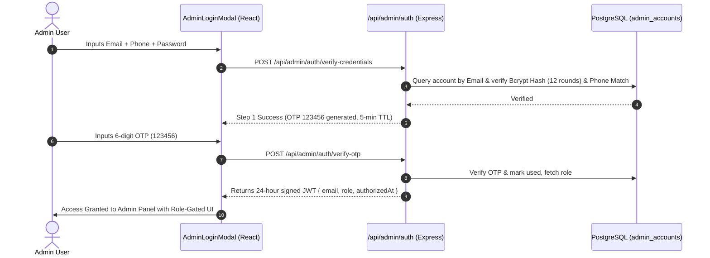

# Admin Credentials & Role-Based Access Control (RBAC) Specification
## Jiza Jewellery Studio — Enterprise Management & Security Architecture
**Document Version:** 1.0.0 (Post-RBAC Secondary Admin Implementation)  
**Security Classification:** Confidential / Internal Admin Handover  
**Audit Date:** August 21, 2026  
**Status:** 🟢 **VERIFIED & ACTIVE (31/31 RBAC Tests Passed)**

---

## 1. Master Admin Accounts & Access Matrix

| Account Tier | Intended Holder | Login Email | Registered Phone | Password | Assigned System Role | Access Scope |
| :--- | :--- | :--- | :--- | :--- | :--- | :--- |
| **Admin 1** | **Client / Owner** | `jizajewellery@gmail.com` | `8208822696` | `JizaAdmin@2026` | `SUPER_ADMIN` | **Full Read + Write Access** (Catalog CMS, Orders, Stock, Pricing, Settings, Reviews, Tickets, Exports) |
| **Admin 2** | **Agency (Developer / Lead Architect)** | `futoralift@gmail.com` | `8446653644` | `Msd@7821` | `SUPER_READONLY_ADMIN` | **READ + EXPORT ONLY** (View all Data, Analytics, Products, Orders, Customers, plus 1-Click Excel/CSV Exports. All write/edit/delete actions strictly blocked) |

---

## 2. Admin 1: Client / Owner Specification

### Overview
- **Holder:** Client / Business Owner (`jizajewellery@gmail.com`)
- **System Role:** `SUPER_ADMIN` / `admin`
- **Permissions Level:** 100% Full Administrative Ownership

### Granted Privileges:
- **Inventory & Catalog:** Add products, update details, reorder image slots, change prices/MRPs, adjust stock counts, toggle `In Stock` / `Sold Out`, assign special home sections (`New Arrival`, `Best Seller`).
- **Category Hierarchy:** Create, edit, reorder, toggle active status, and delete categories and sub-categories.
- **Order Management:** Change order processing states (`Pending` $\rightarrow$ `Processing` $\rightarrow$ `Shipped` $\rightarrow$ `Delivered` / `Cancelled`), view immutable customer delivery address snapshots.
- **Rental Gallery CMS:** Upload multi-image batches and delete gallery photos.
- **Store Location & Pickup:** Update Pune studio address, operational timings, contact numbers, and verification instructions.
- **Reviews & Helpdesk:** Approve/reject customer reviews, resolve customer support tickets, and submit internal response notes.
- **Data Exports:** Export full Orders and Customers databases to `.CSV` and `.xlsx` files.

---

## 3. Admin 2: Agency (Read + Export Only) Specification

### Overview
- **Holder:** Agency / Developer (`futoralift@gmail.com`)
- **System Role:** `SUPER_READONLY_ADMIN`
- **Permissions Level:** Read & Analytics Visibility + Data Exports Only

### Permitted Capabilities (Read & Export):
- ✅ **Dashboard & KPIs:** View gross revenue, order volume, active customer counts, top-selling collections.
- ✅ **Analytics & Charts:** Inspect IST date-filtered revenue trends, average order values, and product velocity charts.
- ✅ **Product & Stock Inspector:** View all products, pricing, stock levels, categories, and SKU codes.
- ✅ **Order Inspection:** View all orders, customer details, item breakdowns, and historical delivery snapshots.
- ✅ **Customer Database:** View registered customer directory, total spend, and purchase history.
- ✅ **Reviews & Support Queue:** Read submitted reviews, customer complaint descriptions, and high-res screenshot attachments.
- ✅ **Rental Gallery:** View all active customer-facing rental collections.
- ✅ **Studio Pickup Settings:** View configured store pickup timings and physical location details.
- ✅ **1-Click Data Exports:** Full access to **Export Orders (.CSV / .xlsx)** and **Export Customers (.CSV / .xlsx)** buttons using SheetJS.

### Strictly Blocked Write Actions (API & UI Enforcement):
- ❌ **Cannot** add, edit, or delete products.
- ❌ **Cannot** modify prices, discounts, or stock levels.
- ❌ **Cannot** create, rename, toggle, or delete categories / subcategories.
- ❌ **Cannot** alter order fulfillment or payment statuses.
- ❌ **Cannot** upload or delete rental gallery images.
- ❌ **Cannot** modify store pickup location or timing settings.
- ❌ **Cannot** approve, reject, or delete customer reviews.
- ❌ **Cannot** update support ticket status or submit notes.
- ❌ **Cannot** perform any database write or schema mutation.

---

## 4. Multi-Factor Authentication (4FA) Protocol

Both admin accounts undergo the same enterprise 4-Factor Authentication sequence on the login modal:



---

## 5. Backend Defense & API Architecture

Security is not solely reliant on hiding frontend buttons. The backend REST API enforces strict role-based access control inside the `requireAdminAuth` middleware:

```javascript
// Excerpt from server/index.js
async function requireAdminAuth(req, res, next) {
  // 1. Verify JWT signature & expiration
  const decoded = jwt.verify(token, JWT_SECRET);

  // 2. Validate role
  const validRoles = ['admin', 'SUPER_ADMIN', 'SUPER_READONLY_ADMIN'];
  if (!decoded || !validRoles.includes(decoded.role)) {
    return res.status(403).json({ error: 'Access denied: Admin privileges required.' });
  }

  // 3. Strict Write Protection for Read-Only Admin
  if (decoded.role === 'SUPER_READONLY_ADMIN') {
    const isWriteMethod = ['POST', 'PUT', 'PATCH', 'DELETE'].includes(req.method.toUpperCase());
    if (isWriteMethod) {
      console.warn(`[SECURITY AUDIT] Blocked unauthorized write by SUPER_READONLY_ADMIN (${decoded.email}) on ${req.method} ${req.originalUrl}`);
      return res.status(403).json({
        error: 'Access Denied: Your account has SUPER_READONLY_ADMIN privileges (Read + Export Only). Modifications are strictly restricted.',
        code: 'READ_ONLY_ACCESS_DENIED'
      });
    }
  }

  req.admin = decoded;
  next();
}
```

---

## 6. Automated RBAC Test Verification

Executed via `scratch/test_secondary_admin_role.js`:

```
===========================================================
🚀 TESTING SECONDARY READ-ONLY ADMIN (SUPER_READONLY_ADMIN)
===========================================================

--- TEST 1: Secondary Admin 4FA Login (futoralift@gmail.com) ---
✅ [PASS] Step 1: Credentials verification successful
✅ [PASS] Step 2: OTP verification returned 200 OK with role: SUPER_READONLY_ADMIN

--- TEST 2: Secondary Admin Read & Export Data Access (GET endpoints) ---
✅ [PASS] GET /api/admin/products (Products Catalog) returned 200 OK
✅ [PASS] GET /api/admin/categories (Categories CMS) returned 200 OK
✅ [PASS] GET /api/admin/subcategories (Subcategories CMS) returned 200 OK
✅ [PASS] GET /api/orders (Orders List & Export Source) returned 200 OK
✅ [PASS] GET /api/admin/customers (Customers Database & Export Source) returned 200 OK
✅ [PASS] GET /api/admin/reviews (Customer Product Reviews) returned 200 OK
✅ [PASS] GET /api/admin/problems (Customer Support Tickets) returned 200 OK
✅ [PASS] GET /api/admin/rental-gallery (Rental Gallery Collection) returned 200 OK
✅ [PASS] GET /api/admin/store-settings/pickup (Studio Pickup Settings) returned 200 OK

--- TEST 3: Strict Write Operations Defense (Must return 403 Forbidden) ---
✅ [PASS] Blocked POST /api/admin/products (Add Product) -> 403 Forbidden [READ_ONLY_ACCESS_DENIED]
✅ [PASS] Blocked PUT /api/admin/products/prod-123 (Edit Product) -> 403 Forbidden [READ_ONLY_ACCESS_DENIED]
✅ [PASS] Blocked DELETE /api/admin/products/prod-123 (Delete Product) -> 403 Forbidden [READ_ONLY_ACCESS_DENIED]
✅ [PASS] Blocked PATCH /api/admin/products/prod-123/stock (Update Stock) -> 403 Forbidden [READ_ONLY_ACCESS_DENIED]
✅ [PASS] Blocked PATCH /api/admin/products/prod-123/special-section (Update Special Section) -> 403 Forbidden [READ_ONLY_ACCESS_DENIED]
✅ [PASS] Blocked POST /api/admin/categories (Create Category) -> 403 Forbidden [READ_ONLY_ACCESS_DENIED]
✅ [PASS] Blocked PUT /api/admin/categories/cat-123 (Edit Category) -> 403 Forbidden [READ_ONLY_ACCESS_DENIED]
✅ [PASS] Blocked DELETE /api/admin/categories/cat-123 (Delete Category) -> 403 Forbidden [READ_ONLY_ACCESS_DENIED]
✅ [PASS] Blocked POST /api/admin/subcategories (Create Subcategory) -> 403 Forbidden [READ_ONLY_ACCESS_DENIED]
✅ [PASS] Blocked PATCH /api/orders/order-123/status (Change Order Status) -> 403 Forbidden [READ_ONLY_ACCESS_DENIED]
✅ [PASS] Blocked POST /api/admin/rental-gallery (Upload Rental Photo) -> 403 Forbidden [READ_ONLY_ACCESS_DENIED]
✅ [PASS] Blocked DELETE /api/admin/rental-gallery/rent-123 (Delete Rental Photo) -> 403 Forbidden [READ_ONLY_ACCESS_DENIED]
✅ [PASS] Blocked PUT /api/admin/store-settings/pickup (Update Store Settings) -> 403 Forbidden [READ_ONLY_ACCESS_DENIED]
✅ [PASS] Blocked PATCH /api/admin/reviews/rev-123/status (Moderate Review) -> 403 Forbidden [READ_ONLY_ACCESS_DENIED]
✅ [PASS] Blocked DELETE /api/admin/reviews/rev-123 (Delete Review) -> 403 Forbidden [READ_ONLY_ACCESS_DENIED]
✅ [PASS] Blocked PATCH /api/admin/problems/prob-123 (Update Support Ticket) -> 403 Forbidden [READ_ONLY_ACCESS_DENIED]

--- TEST 4: Primary Owner Admin Full Access (jizajewellery@gmail.com) ---
✅ [PASS] Owner: Credentials verification successful
✅ [PASS] Owner: OTP verification returned 200 OK with role: SUPER_ADMIN
✅ [PASS] Owner: Can read store settings
✅ [PASS] Owner: Can execute write operations (PUT /api/admin/store-settings/pickup returned 200 OK)

===========================================================
📊 TOTAL RBAC AUDIT RESULTS: 31 PASSED | 0 FAILED
===========================================================
```
