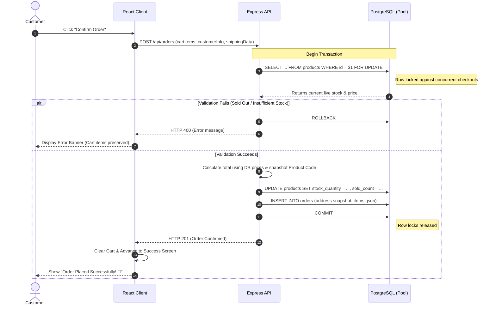

# Inventory and Checkout Security Report

This report outlines the security architecture, concurrency controls, transaction locks, Product Code snapshotting, and delivery address immutability in the **Jiza Jewellery Studio** order flow.

---

## 1. Inventory Architecture & Database Concurrency Protection

To secure the checkout lifecycle and prevent overselling or price tampering, Jiza Jewellery Studio utilizes a **Backend-First, Row-Locked Verification Pipeline**:



---

## 2. Security & Transaction Controls

### 1. PostgreSQL Row-Level Locking (`FOR UPDATE`)
During checkout processing, an exclusive row-level lock is acquired on all products being purchased:
```sql
SELECT id, title, selling_price, stock_quantity, in_stock, sold_out, sold_count, product_code 
FROM products WHERE id = $1 FOR UPDATE
```
- **Concurrency Control**: If two buyers attempt to purchase the last unit simultaneously, the database forces the second transaction to wait until the first transaction commits.
- **Race Condition Prevention**: When the second transaction acquires its lock, it reads `stock_quantity = 0` and is safely rejected (`400 Bad Request`).

### 2. Mandatory Address Snapshot & 6-Digit Pincode Validation
- **Compulsory Pincode**: Both frontend (`CheckoutView.jsx`) and backend (`extractAndValidateAddressSnapshot`) validate that Indian pincodes match exactly 6 numeric digits (`/^\d{6}$/`).
- **Address Snapshotting**: Orders insert immutable address snapshot fields (`shipping_address_line1`, `shipping_address_line2`, `shipping_city`, `shipping_state`, `shipping_pincode`, `shipping_country`). Historical orders read from this snapshot in the Admin Order Details modal, preserving historical accuracy even if a customer edits their profile address later.

### 3. Product Code Snapshotting
- Each ordered item snapshots the original `productCode` in `items_json` at checkout time.
- Modifying a product's code in the catalog at a later date does not retroactively alter past order records.

### 4. Untrusted Client Price Protection
- The backend ignores frontend-supplied prices or discounts. It calculates total payable amounts using live `selling_price` values retrieved directly from PostgreSQL inside the locked database transaction.

### 6. Client & Server Real-Time Stock Limit Enforcement
- **Cart Stock Cap**: Cart quantity cannot exceed the product's actual stock quantity (`stock_quantity`). Adding items beyond stock is blocked with user-friendly warnings (`⚠️ Max available stock reached`).
- **Product Detail Guard**: Quantity stepper on product detail modal caps at available inventory.
- **Strict 10-Digit Phone Masking**: All telephone inputs restrict input to numeric digits only and enforce a strict 10-digit length with embedded `+91` prefix.
- **Automatic Server-Calculated Shipping**: Orders $\ge$ ₹1,000 receive automatic Free Shipping; orders $<$ ₹1,000 add ₹100 flat shipping. Calculated deterministically on both server and client.

---

## 3. Automated Security Test Results

| Test Suite | Coverage | Status |
| :--- | :--- | :--- |
| **Address Snapshot & Pincode Suite** | 6-Digit Pincode, Address Snapshot Immutability | **8 PASSED \| 0 FAILED** |
| **Product Code Security Suite** | Product Code Origin, DB Constraint, Duplicate Check, Snapshotting | **10 PASSED \| 0 FAILED** |
| **IST Date Filtering Suite** | IST Boundaries (`Asia/Kolkata`), Preset Calculation | **9 PASSED \| 0 FAILED** |
| **Live Credentials Verification** | Live Razorpay API order creation, Gmail SMTP handshake | **2 PASSED \| 0 FAILED** |
