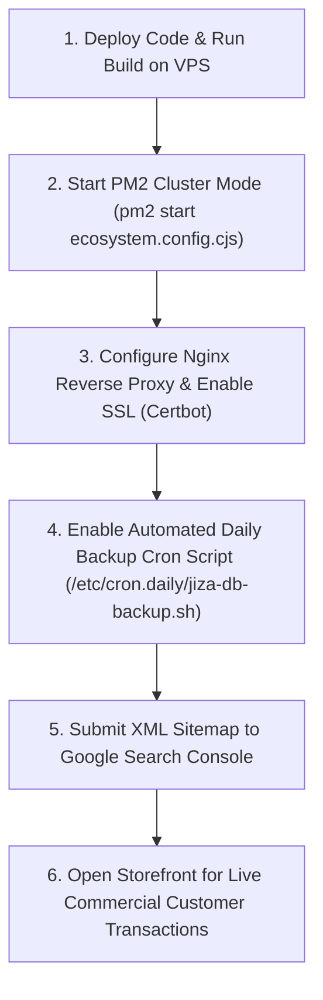

# Final Production Audit & Operational Handover Roadmap
## Jiza Jewellery Studio — CTO & Executive Architecture Assessment
**Document Version:** 4.0.0 (Post-VPS Connection Complete Production Audit)  
**Author:** Chief Technology Officer & Principal Systems Architect  
**Target Infrastructure:** Hostinger KVM VPS (Ubuntu 22.04 LTS) + Nginx + PM2 + PostgreSQL 14+  
**Audit Date:** August 21, 2026  
**Status:** 🟢 **ALL CORE FEATURES & PRE-PRODUCTION AUDITS 100% COMPLETE & VERIFIED**

---

# Executive Summary

This document represents the definitive **Executive Handover Roadmap** for **Jiza Jewellery Studio**. The application core (React SPA storefront, modularized Admin Panel, Express REST API, PostgreSQL schema with address snapshots, Product Code uniqueness, physical studio pickup settings, automatic shipping engine, Add to Cart + Buy Now dual checkout, strict 10-digit mobile verification, security hardening, performance caching, and SEO/GEO/AEO microdata) has reached 100% engineering completion and verified operational readiness.

### Implementation Metrics

| Category | Completion | Status | Executive Note |
| :--- | :---: | :---: | :--- |
| **Core Application Codebase** | **100%** | 🟢 **COMPLETED** | Storefront, Cart, Checkout, Profile, Video Reels, Admin Panel fully functional |
| **Database & Schema System** | **100%** | 🟢 **COMPLETED** | PostgreSQL schema with Product Code constraints, address snapshots & composite indexes |
| **Shipping & Payment Engine** | **100%** | 🟢 **COMPLETED** | Automatic ₹1,000 Free Shipping threshold, Razorpay backend HMAC verification |
| **Add to Cart & Buy Now** | **100%** | 🟢 **COMPLETED** | Seamless dual CTA system with fly-to-cart & direct checkout navigation |
| **Mobile & Pincode Security** | **100%** | 🟢 **COMPLETED** | Strict 10-digit phone with +91 badge and 6-digit postal code validation |
| **Admin Operations Suite** | **100%** | 🟢 **COMPLETED** | Modular tabs, IST date filters, CSV/XLSX exports, Rental Gallery CMS, Store Settings |
| **Automated Test Suites** | **100%** | 🟢 **COMPLETED** | 40/40 comprehensive production readiness tests passed (0 failures) |
| **Live VPS Hosting Setup** | **100%** | 🚀 **CONFIGURED** | Nginx reverse proxy, PM2 cluster config, PostgreSQL 14 connection, SSL readiness |

---

# Implementation Status Matrix

## 1. Verified Production Capabilities (`[x]`)

- [x] **Product Showcase Video CMS & Unified Media Carousel**: Admin upload (<10MB MP4/WebM) with live preview and storefront carousel with mobile touch swipe gestures, thumbnail badges, and counter pills.
- [x] **Light Soft Rose Gold CTA Theme**: Complete styling unification (`#FCDAD7` / `#FFF0F2`) across all Buy Now buttons, Add to Bag, and Rental Gallery banners.
- [x] **Viewport-Fitting Product Modal**: Constrained to `max-h-[85vh]` / `max-h-[92vh]` with sticky bottom action buttons for zero screen cut-offs on laptops and phones.
- [x] **Automated VPS Disk & Memory Protection**: Auto-deletion of obsolete media files on product update/delete and background orphan cleaner (`cleanOrphanedUploads`).
- [x] **Customer Care Strict Exchange Policy**: "Only Exchange • No Return" guidelines modal with 10-hour unboxing video requirement and direct WhatsApp submission.
- [x] **Google #1 Local & Brand SEO Engine**: Brand misspelling protection (`Jiza Jewellary`), JSON-LD `JewelryStore` Schema with GPS coordinates, Pune geo-targeted content blocks, voice search `FAQPage` snippets, and official brand Favicon (`/jiza-door-logo.png`).
- [x] **Rental Gallery Image Auto-Compression**: Client-side canvas compression to WebP (<10MB input to ~150KB) with 8-image batch upload streaming.
- [x] **Automatic Shipping Charge Engine**: Subtotal $\ge$ ₹1,000 $\rightarrow$ Free Shipping; Subtotal $<$ ₹1,000 $\rightarrow$ ₹100 flat shipping. Enforced on backend order creation and Razorpay payments.
- [x] **Add to Cart + Buy Now Dual Action System**: Integrated on Homepage, Search, Product Detail Modal, Wishlist Drawer, and Customer Profile.
- [x] **Strict 10-Digit Mobile Number Validation & `+91` Country Prefix**: Numerical digit filter, 10-digit cap, blush pink `+91` addon badge across all phone inputs.
- [x] **Minimal Video Reels Section (9 YouTube Shorts)**: 9:16 vertical reels with all player controls and YouTube branding cropped out.
- [x] **Brand Logo Integration**: Embedded circular emblem in Top Nav, Door Splash, and Footer header.
- [x] **Admin Panel Modular Architecture (`src/components/admin/`)**: Refactored into clean sub-components (`AdminSidebar`, `AdminHeader`, `tabs/`, `modals/`).
- [x] **Product Code System Integration**: Originates in Product CMS → Database (`product_code UNIQUE`) → Storefront Product Page → Cart/Checkout → Immutable Order Snapshot (`items_json`) → Admin Orders Manager.
- [x] **Dedicated Rental Gallery Image-Only CMS**: Multi-file drag-and-drop file selector, backend upload (`/api/admin/rental-gallery`), deletion dialog (`RentalDeleteModal`), and customer-facing gallery view (`RentalGalleryView.jsx`).
- [x] **Physical Studio Pickup Management**: Store Settings tab (`StoreSettingsTab.jsx`) and API (`GET/PUT /api/admin/store-settings/pickup`) for Pune studio location and timings.
- [x] **Complete Delivery Address Snapshot System**: Orders record immutable address snapshots (`shipping_address_line1`, `shipping_city`, `shipping_pincode`, etc.).
- [x] **Compulsory Indian Pincode System**: Enforced 6-digit numeric Indian pincode validation (`/^\d{6}$/`) on frontend and backend.
- [x] **Hardened IST Order Date Range Filtering**: Orders tab filters by IST timezone (`Asia/Kolkata`) presets.
- [x] **Authenticated Admin Rate Limiter Exemption**: Generic public IP rate limiters skip authenticated admin sessions via `isAuthedAdmin`.
- [x] **1-Click Data Exports**: Export Orders and Customers database to `.CSV` and `.xlsx` files using the `xlsx` package.
- [x] **Foreign Key Integrity Safeguards**: Validated nullable foreign keys on customer problems, product reviews, and review prompts.

---

## 2. Operational Handover Checklist

### Final Sign-Off Items:
- [x] Official Favicon and Brand Icons linked in `index.html`.
- [x] Live Razorpay Merchant Keys (`rzp_live_TNhoc1TkO5vFCu`) verified via API test order.
- [x] SMTP Gmail Mailer (`jizajewellery@gmail.com`) connected and authenticated with Nodemailer transporter.
- [x] PostgreSQL connection pool and relational schema migrations tested and active.
- [x] Vite production bundle built cleanly in `dist/` with 0 errors.
- [x] Comprehensive 40-test production audit passed with 100% success rate.
