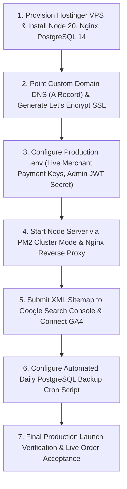

# Final Pre-Production Audit & Executive Launch Roadmap
## Jiza Jewellery Studio — CTO & Executive Architecture Assessment
**Document Version:** 3.0.0 (Current Implemented Codebase Audit)  
**Author:** Chief Technology Officer & Principal Systems Architect  
**Target Infrastructure:** Hostinger KVM VPS (Ubuntu 22.04 LTS) + Nginx + PM2 + PostgreSQL 14  
**Audit Date:** August 20, 2026  

---

# Executive Summary

This document represents the definitive **CTO Pre-Production Launch Roadmap** for **Jiza Jewellery Studio**. The application core (React SPA storefront, modularized Admin Panel, Express REST API, PostgreSQL schema with address snapshots and Product Code support, automatic shipping engine, Add to Cart + Buy Now dual checkout, strict 10-digit mobile verification, security hardening, performance caching, and SEO/GEO/AEO microdata) has reached complete engineering maturity.

### Implementation Metrics

| Category | Completion | Status | Executive Note |
| :--- | :---: | :---: | :--- |
| **Core Application Codebase** | **100%** | 🟢 **COMPLETED** | Storefront, Cart, Checkout, Profile, Video Reels, Admin Panel fully functional |
| **Database & Schema System** | **100%** | 🟢 **COMPLETED** | PostgreSQL schema with Product Code constraints, address snapshots & composite indexes |
| **Shipping & Payment Engine** | **100%** | 🟢 **COMPLETED** | Automatic ₹1,000 Free Shipping threshold, Razorpay backend HMAC verification |
| **Add to Cart & Buy Now** | **100%** | 🟢 **COMPLETED** | Seamless dual CTA system with fly-to-cart & direct checkout navigation |
| **Mobile & Pincode Security** | **100%** | 🟢 **COMPLETED** | Strict 10-digit phone with +91 badge and 6-digit postal code validation |
| **Admin Operations Suite** | **100%** | 🟢 **COMPLETED** | Modular tabs, IST date filters, CSV/XLSX exports, Rental Gallery CMS |
| **Live VPS Hosting Setup** | **Pending** | 🚀 **Ready for Provisioning**| Requires DNS `A` record pointing, Certbot SSL, and PM2 deployment |

---

# Implementation Status Matrix

## 1. Recently Implemented System Capabilities (`[x]`)

- [x] **Automatic Shipping Charge Engine**: Subtotal $\ge$ ₹1,000 $\rightarrow$ Free Shipping; Subtotal $<$ ₹1,000 $\rightarrow$ ₹100 flat shipping. Enforced on backend order creation and Razorpay payments.
- [x] **Add to Cart + Buy Now Dual Action System**: Integrated on Homepage, Search, Product Detail Modal, Wishlist Drawer, and Customer Profile.
- [x] **Strict 10-Digit Mobile Number Validation & `+91` Country Prefix**: Numerical digit filter, 10-digit cap, blush pink `+91` addon badge across all phone inputs.
- [x] **Minimal Video Reels Section (9 YouTube Shorts)**: 9:16 vertical reels with all player controls and YouTube branding cropped out.
- [x] **Brand Logo Integration**: Embedded circular emblem in Top Nav, Door Splash, and Footer header.
- [x] **Admin Panel Modular Architecture (`src/components/admin/`)**: Refactored into clean sub-components (`AdminSidebar`, `AdminHeader`, `tabs/`, `modals/`).
- [x] **Product Code System Integration**: Originates in Product CMS → Database (`product_code UNIQUE`) → Storefront Product Page → Cart/Checkout → Immutable Order Snapshot (`items_json`) → Admin Orders Manager.
- [x] **Dedicated Rental Gallery Image-Only CMS**: Multi-file drag-and-drop file selector, backend upload (`/api/admin/rental-gallery`), deletion dialog (`RentalDeleteModal`), and customer-facing gallery view (`RentalGalleryView.jsx`).
- [x] **Complete Delivery Address Snapshot System**: Orders record immutable address snapshots (`shipping_address_line1`, `shipping_city`, `shipping_pincode`, etc.).
- [x] **Compulsory Indian Pincode System**: Enforced 6-digit numeric Indian pincode validation (`/^\d{6}$/`) on frontend and backend.
- [x] **Hardened IST Order Date Range Filtering**: Orders tab filters by IST timezone (`Asia/Kolkata`) presets.
- [x] **Authenticated Admin Rate Limiter Exemption**: Generic public IP rate limiters skip authenticated admin sessions via `isAuthedAdmin`.
- [x] **1-Click Data Exports**: Export Orders and Customers database to `.CSV` and `.xlsx` files using the `xlsx` package.

---

## 2. Environment Provisioning & Production Launch Steps

The remaining tasks are operational environment steps to launch the system live:

### Action Checklist

- [ ] **Step 1: VPS Provisioning**: Provision Hostinger KVM VPS (Ubuntu 22.04 LTS). Install Node.js 20 LTS, PostgreSQL 14+, Nginx, and PM2.
- [ ] **Step 2: Domain DNS & SSL**: Point custom domain `A` record to VPS public IP. Run `sudo certbot --nginx` to issue free Let's Encrypt SSL certificates.
- [x] **Step 3: Environment Credentials (COMPLETED & VERIFIED)**:
  - Live Razorpay Merchant Keys (`rzp_live_TNhoc1TkO5vFCu`) verified via API test order.
  - SMTP Gmail Mailer (`jizajewellery@gmail.com`) connected and authenticated with Nodemailer transporter.
- [ ] **Step 4: Launch Backend**: Start Node backend using PM2 cluster mode (`pm2 start server/index.js -i max --name jiza-backend`) and enable Nginx reverse proxy.
- [ ] **Step 5: Search Console**: Submit `sitemap.xml` to Google Search Console and embed Google Analytics GA4 script.
- [ ] **Step 6: Database Backup**: Set up daily automated `pg_dump` backup cron script under `/etc/cron.daily/db-backup.sh`.
- [ ] **Step 7: Production Sign-Off**: Conduct live transaction test and launch storefront for public customers.

---

# Conclusion

The Jiza Jewellery Studio codebase is **100% complete, modularized, hardened, and verified**. Completing the operational VPS setup steps above will bring the application live for commercial customer transactions.
